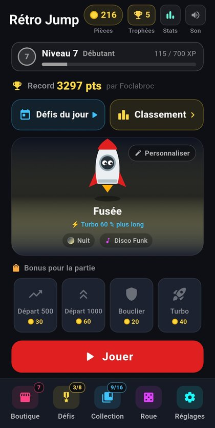
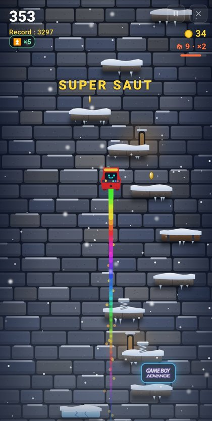
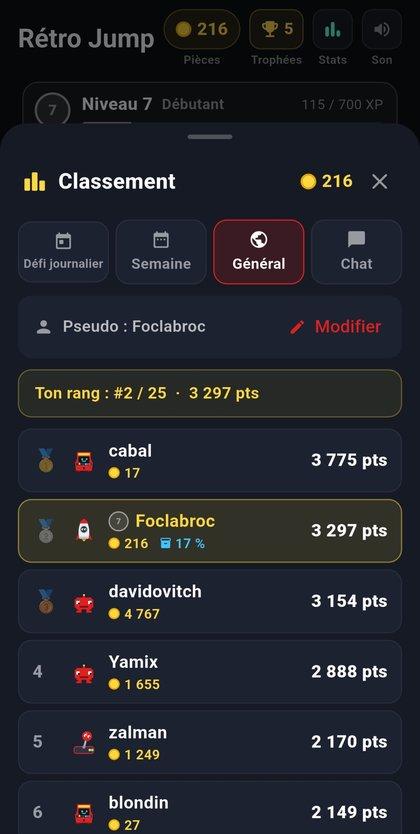
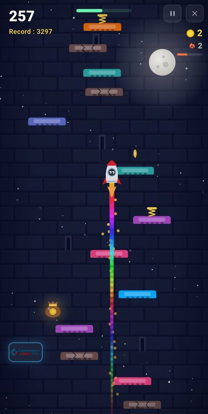
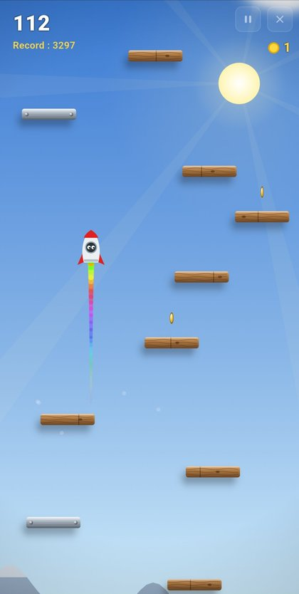
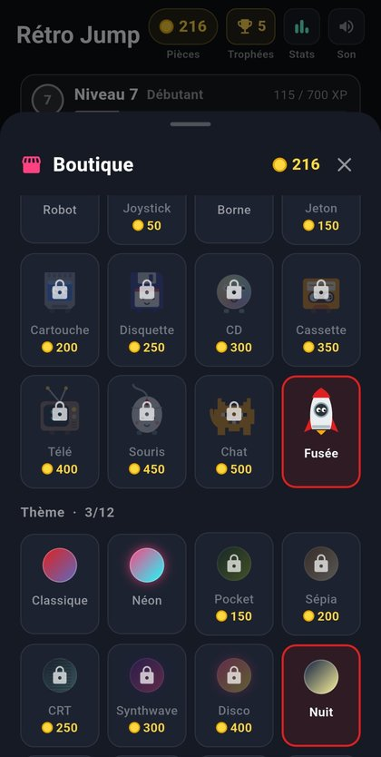
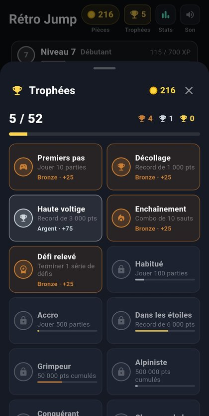
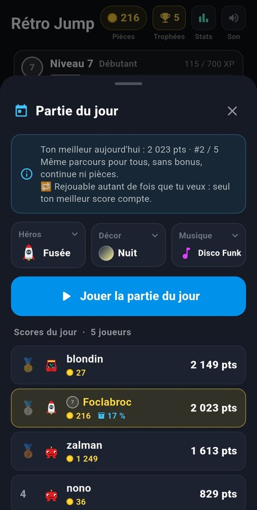
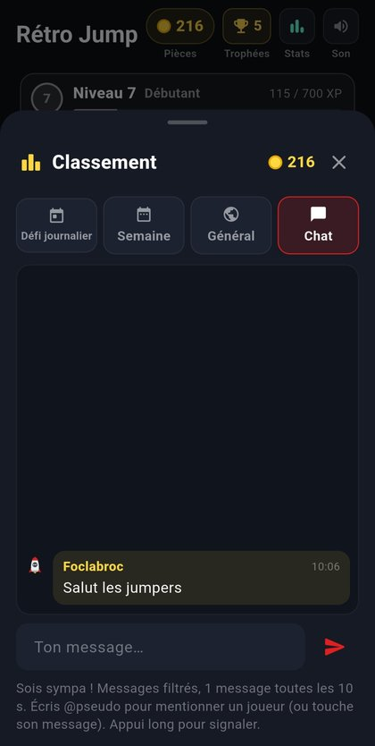

# Rétro Jump 🚀

**Jeu de saut vertical au style rétro pour Android, avec classement en ligne, chat et défi du jour.**

Grimpe le plus haut possible en sautant de cartouche en cartouche, écrase les bugs, attrape les logos de consoles et bats les records des autres joueurs !

<p align="center">
  
  
  
</p>

---

## 📥 Télécharger

[](https://github.com/foclabroc/retro_jump_app/releases/latest)

- Prends le fichier `…V<version>.apk` le plus récent dans la release
- **Français / English** : la langue suit celle du téléphone
- L'appli **vérifie elle-même les mises à jour** au lancement (et via Réglages → « Vérifier les mises à jour »)

> Rétro Jump est aussi disponible comme mini-jeu dans [Foclabroc Remote](https://github.com/foclabroc/foclabroc-remote) — **même classement, même chat**.

---

## 🎮 Le jeu

- **Commandes** : touche gauche / droite de l'écran, ou **inclinaison du téléphone**
- **Cartouches** normales, mobiles, fissurées (elles cassent !) et **ressorts** pour les super sauts
- **Bugs** à écraser en leur sautant dessus (sinon ils te font tomber)
- **Bonus** : turbo, bouclier, aimant à pièces, pièces ×2, super saut, ralenti
- **Combo** : enchaîne des cartouches de plus en plus hautes → pièces ×2, ×3… jusqu'à ×5
- **Décor qui change tous les 400 pts** : château, donjon, temple, glace, volcan, cyber, espace…
- **Météo dynamique** : coup de vent, pluie qui fait glisser, orage (avec pluie de pièces !) et brouillard
- **Continue** : perdu ? Repars une fois par partie contre quelques pièces
- **Bonus de départ** à acheter avant la partie : départ à 500 / 1 000 pts, bouclier, turbo

<p align="center">
  
  
  
</p>

---

## 🛍️ Boutique & personnalisation

- **12 héros**, chacun avec son **pouvoir** : Robot, Joystick, Borne, Jeton, Cartouche, Disquette, CD, Cassette, Télé, Souris, Chat, Fusée
  *(plus rapide, saute plus haut, attire les pièces, turbo plus long, bouclier au départ…)*
- **12 thèmes** : Classique, Néon, Pocket, Sépia, CRT, Synthwave, Disco, Nuit, Négatif, Matrix, **Réaliste**, **Tour gelée** (neige qui tombe)
- **7 musiques** : Disco Funk, Shop, Good Morning, 8-bit Retro, Mountain, Video Game, Pixel Fight
- **6 traînées de saut** : arc-en-ciel, étincelles, pixels, flammes, bulles…
- **Roue de la fortune** : un tour gratuit par jour (pièces, bonus ou « rejouer offert »)

<p align="center">
  
</p>

---

## 🏆 Progression

- **Niveau joueur (XP)** : chaque partie rapporte de l'XP → niveaux 1 à 99, avec un rang tous les 10 niveaux
  (Débutant → Bronze → Argent → Or → Platine → Diamant → Maître → Légende) et des **pièces à chaque niveau**
- **52 trophées** permanents (bronze, argent, or) : parties jouées, records, bugs écrasés, combos, jours d'affilée, podium du défi du jour… Chaque trophée rapporte des pièces
- **Défis** : séries de 8 objectifs, de plus en plus durs à chaque série terminée
- **Collection** : attrape les **logos de consoles** (NES, SNES, PlayStation, Game Boy, Amiga…) pour compléter des albums de 16 logos
- **Statistiques à vie** : parties, temps de jeu, sauts, bugs écrasés, meilleur combo…
- **Sauvegarder / Charger** sa progression (fichier dans *Téléchargements*) — pratique pour changer de téléphone ou passer de Foclabroc Remote à Rétro Jump avec le **même pseudo**

<p align="center">
  
</p>

---

## 🌍 En ligne

- **Partie du jour** : le **même parcours pour tous**, chaque jour à minuit. Choisis ton héros, ton décor et ta musique, rejoue autant que tu veux : seul ton meilleur score compte
- **Classements** : défi journalier, semaine (remise à zéro le lundi) et général
- **Fantôme du n°1** : dans la partie du jour, cours contre le trajet du meilleur joueur
- **Ligne de record** des autres joueurs affichée pendant la partie
- **Fiche joueur** : touche un joueur pour voir son niveau, ses rangs, ses trophées et toutes ses stats
- **Avancement %** de chaque joueur (boutique + albums + trophées) affiché dans le classement
- **Chat** : messages filtrés (gros mots, liens, numéros masqués), **mentions @pseudo** avec notification, signalement par appui long
- **Pseudo unique** (personne ne peut prendre le tien)

<p align="center">
  
  
  
</p>

> Le classement et le chat utilisent [Supabase](https://supabase.com). Aucun compte n'est demandé : un identifiant aléatoire est créé sur le téléphone, seul le pseudo choisi est visible des autres joueurs.

---

## 📋 Prérequis

- Un téléphone Android
- Connexion Internet pour le classement, le chat et la partie du jour (le jeu fonctionne hors ligne ; les scores sont envoyés plus tard)

---

## 🚀 Installation

1. Télécharge le dernier APK depuis les [Releases](https://github.com/foclabroc/retro_jump_app/releases/latest)
2. Autorise l'installation depuis des sources inconnues si Android le demande
3. Installe, choisis ton pseudo… et saute !

---

## 🛠️ Compiler depuis les sources

```bash
# Prérequis : Flutter SDK >= 3.0
git clone https://github.com/foclabroc/retro_jump_app.git
cd retro_jump_app
flutter pub get
flutter build apk --release
```

Nouvelle version : modifier `kRetroJumpVersion` dans `lib/update_check.dart` **et** `version:` dans `pubspec.yaml`, puis ajouter l'APK à la release en le nommant `…V<version>.apk`.

---

## 📦 Stack technique

- **Flutter / Dart** — tout le jeu est dessiné en `CustomPainter` (aucun moteur de jeu)
- **Supabase** (PostgreSQL + API REST) pour le classement, les fantômes et le chat, avec fonctions SQL signées
- `shared_preferences`, `sensors_plus` (inclinaison), `wakelock_plus`, `share_plus`, `url_launcher`, `crypto`

---

## 👨‍💻 Auteur

**foclabroc** — [GitHub](https://github.com/foclabroc) · [YouTube](https://www.youtube.com/@foclabroc59)
